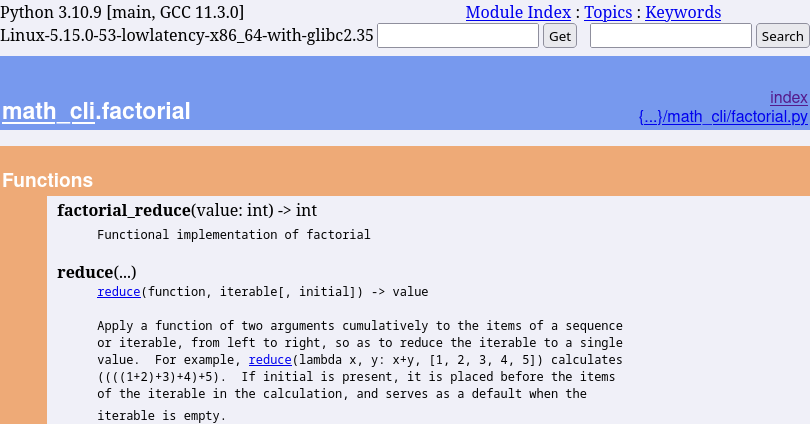

:revealjs_customtheme: assets/doc-tracing.css
:revealjs_progress: true
:revealjs_slideNumber: true
:source-highlighter: highlightjs
:icons: font
:toc:

= Doc-tracing

== Traçage d'exécution du code à des fins documentaires

Outiller les discussions d'architecture avec des diagrammes d'exécution des tests fonctionnels.

[.small]
*Luc Sorel-Giffo* -- jeudi 6 avril 2023 -- Soirée des communautés techniques rennaises

[.small]
https://floss.social/@lucsorelgiffo[@lucsorelgiffo@floss.social]

== Genèse de l'idée : du doc-as-code ++

* documenter une base de code, c'est bien
* écrire de la documentation, c'est pénible / _improductif_
* maintenir de la documentation, c'est... rarement fait

🎉 `doc-as-code` :

* 🎓 écrire la doc comme on écrit du code (fichiers _texte_, DSL)
* 💡 générer la doc à partir du code !

[.columns]
=== Il y a 2 types de code dans le doc-as-code

[.column]
--

[.small]
Le code source (vérité)

[source,python]
----
# school.py
from dataclasses import \
    dataclass

@dataclass
class Person:
    firstname: str
    lastname: str

@dataclass
class Course:
    name: str
    teacher: Person

@dataclass
class Student(Person):
    courses: list[Course]
----
--

[.column]
--

[.small]
Le code de la doc (PlantUML, Asciidoc, etc.)

[source,java]
----
# school.puml
@startuml school
class school.Course {
  name: str
  teacher: Person
}
class school.Person {
  firstname: str
  lastname: str
}
class school.Student {
  courses: list[Course]
}
school.Course *-- school.Person
school.Student *-- school.Course
school.Person <|-- school.Student
footer Generated by //py2puml//
@enduml
----
--

[.column]
--

[.small]
(le code des outils de génération et de rendu de la doc) +

[plantuml, target=class-diagram, format=svg]
----
@startuml school
class school.Course {
  name: str
  teacher: Person
}
class school.Person {
  firstname: str
  lastname: str
}
class school.Student {
  courses: list[Course]
}
school.Course *-- school.Person
school.Student *-- school.Course
school.Person <|-- school.Student
footer Generated by //py2puml//
@enduml
----
--

=== Doc-as-code par analyse statique de code source - composants

Exemple d'une CLI proposant de calculer `factoriel(n)` ou `fibonacci(n)` :

[plantuml, target=component-diagram, format=svg]
----
@startuml math_cli
package math_cli {
  frame ~__main~__.py {
    component "math~_cli()"
    note bottom of "math~_cli()" : Cli entrypoint
    component "factorial(value: int)"
    component "fibonacci(value: int)"
  }

  frame factorial.py {
    component "factorial~_reduce(value: int) -> int" as FACTORIAL
    note bottom of FACTORIAL : Functional implementation of factorial
  }

  frame fibonacci.py {
    component "fibonacci~_recurse(value: int) -> int" as FIBONACCI
    note bottom of FIBONACCI : Recursive implementation of the Fibonacci suite
  }

  frame validation.py {
    component "validate~_positive~_int(value: int) -> int"
  }
}
@enduml
----

=== Doc-as-code par analyse statique de code source - pydoc

[source, python]
----
# math_cli/factorial.py
from functools import reduce

def factorial_reduce(value: int) -> int:
    '''Functional implementation of factorial'''
    if value == 1:
        return 1

    return reduce(lambda agg, index: agg * index, range(value, 1, -1), 1)
----

[source, sh]
----
python -m pydoc -p 1234 -b
----

[.notes]
--
il existe plein d'outils dans tous les langages
- https://github.com/NiklasRosenstein/pydoc-markdown
- https://pdoc3.github.io/pdoc/
- https://mkdocstrings.github.io/
- https://github.com/vemel/handsdown#-handsdown---python-documentation-generator
- https://pdoc.dev/
- https://github.com/davidenunes/mkgendocs#mkgendocs
- https://github.com/terrencepreilly/darglint#darglint
- https://github.com/PyCQA/pydocstyle/#pydocstyle---docstring-style-checker
- https://github.com/dadadel/pyment#pyment
- https://github.com/Carreau/velin#v%C3%A9lin
--

[.columns]
=== Apports et limites de l'analyse statique de code

[.column]
--
🙂

* code as doc : génération à partir d'une source de vérité
* valorisation : docstring & annotations de typage
--

[.column]
--
🙁

* on sait où se trouvent les fonctions mais pas **la façon dont elles s'articulent**
* on ne voit pas **comment sont gérées les erreurs**
--

[.columns]
=== Traçage d'exécution

[.column]
--
[source, python]
----
from sys import argv

def factorial(n: int) -> int:
    assert n > 0
    if n == 1:
        return 1
    return n * factorial(n - 1)

factorial(int(argv[1]))
----
--

[.column]
--
[source, text]
----
python -m trace --trace trace_factorial.py 3

 --- modulename: trace_factorial, funcname: <module>
trace_factorial.py(1): from sys import argv
trace_factorial.py(3): def factorial(n: int) -> int:
trace_factorial.py(9): factorial(int(argv[1]))
 --- modulename: trace_factorial, funcname: factorial
trace_factorial.py(4):     assert n > 0
trace_factorial.py(5):     if n == 1:
trace_factorial.py(7):     return n * factorial(n - 1)
 --- modulename: trace_factorial, funcname: factorial
trace_factorial.py(4):     assert n > 0
trace_factorial.py(5):     if n == 1:
trace_factorial.py(7):     return n * factorial(n - 1)
 --- modulename: trace_factorial, funcname: factorial
trace_factorial.py(4):     assert n > 0
trace_factorial.py(5):     if n == 1:
trace_factorial.py(6):         return 1
----

_Et si on utilisait des regexp pour faire un diagramme de séquence ⸮_
--

== Doc-tracing

* https://docs.python.org/3/library/trace.html#module-trace
* https://pymotw.com/2/trace/
* https://stackoverflow.com/questions/50558849/python-how-to-trace-function-execution-order-in-large-project
