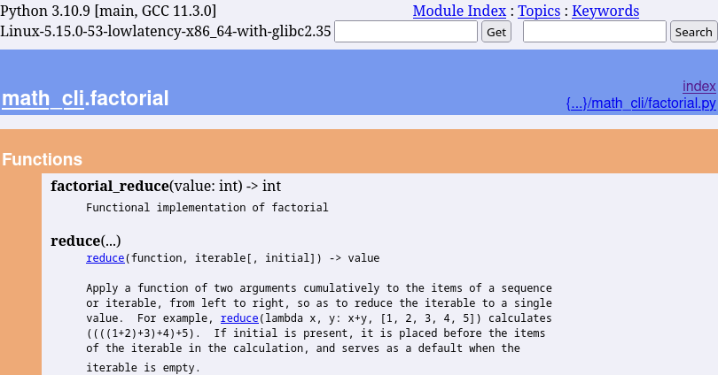
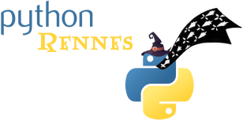

:revealjs_customtheme: assets/doc-tracing_breizhcamp.css
:revealjs_progress: true
:revealjs_slideNumber: true
:source-highlighter: highlightjs
:icons: font
:toc:

= Doc-tracing

== Fouiller une base de code fossile par tracage d'execution

[.jurassic-title]
****
Numeric Park

La documentation disparue
****

[.medium-text]
*Luc Sorel-Giffo* -- jeudi 29 juin 2023 - 12h45 amphi D -- BreizhCamp

[.medium-text]
https://floss.social/@lucsorelgiffo[@lucsorelgiffo@floss.social]

== Synopsis

=== Le site de fouilles : le code

[source,text]
----
math_cli
 ├── __main__.py
 ├── factorial.py
 ├── fibonacci.py
 └── validation.py
----

[.small-text]
💡 Tous les exemples de code se trouvent dans https://github.com/lucsorel/doc-tracing/tree/main/examples/[github.com/lucsorel/doc-tracing/tree/main/examples].

=== La doc

👻 🤷

=== Doc-as-code

[source, text]
----
@startuml math_cli
package math_cli {
  frame __main__.py {
    component "math_cli()"
    component "factorial(value: int)"
    component "fibonacci(value: int)"
  }

  frame factorial.py { component "factorial_reduce(value: int) -> int" }

  frame fibonacci.py { component "fibonacci_recurse(value: int) -> int" }

  frame validation.py { component "validate_positive_int(value: int) -> int" }
}
@enduml
----

[plantuml, target=component-diagram, format=svg]
----
@startuml math_cli
package math_cli {
  frame validation.py {
    component "validate_positive_int(value: int) -> int"
  }
  frame fibonacci.py {
    component "fibonacci_recurse(value: int) -> int" as FIBONACCI
  }
  frame factorial.py {
    component "factorial_reduce(value: int) -> int" as FACTORIAL
  }
  frame ~__main~__.py {
    component "math_cli()"
    component "factorial(value: int)"
    component "fibonacci(value: int)"
  }
}
@enduml
----

=== Analyse statique de code&ensp;-&ensp;"Code-as-doc" 😉

[source, python]
----
# math_cli/factorial.py
from functools import reduce

def factorial_reduce(value: int) -> int:
    '''Functional implementation of factorial'''
    if value == 1:
        return 1

    return reduce(lambda agg, index: agg * index, range(value, 1, -1), 1)
----

[source, sh]
----
python -m pydoc -p 8080 -b # -> http://localhost:8080
----

[.notes]
--
Il existe plein d'outils dans tous les langages. Pour Python :

- https://github.com/NiklasRosenstein/pydoc-markdown
- https://pdoc3.github.io/pdoc/
- https://mkdocstrings.github.io/
- https://github.com/vemel/handsdown#-handsdown---python-documentation-generator
- https://pdoc.dev/
- https://github.com/davidenunes/mkgendocs#mkgendocs
- https://github.com/terrencepreilly/darglint#darglint
- https://github.com/PyCQA/pydocstyle/#pydocstyle---docstring-style-checker
- https://github.com/dadadel/pyment#pyment
- https://github.com/Carreau/velin#v%C3%A9lin
--

[.columns]
=== Analyse statique de code&ensp;-&ensp;apports et limites

[.column]
--
🙂

* génération / mise à jour de la doc à partir d'une source de vérité
* valorisation : docstring & annotations de typage
--

[.column]
--
🙁

* comment **s'articulent** les fonctions ?
* comment sont gérées **les erreurs** ?
--

== Tracage d'execution avec sys.settrace

https://docs.python.org/3/library/sys.html#sys.settrace[sys.settrace] permet de déclarer un hook qui va être appelé à chaque étape d'exécution du code :

[source, python]
----
from sys import settrace

def trace_func(tracer: Callable, func: Callable, *args, **kwargs) -> Any:
    '''Applies the tracer hook during the execution of the given func'''

    settrace(tracer)
    try:
        return func(*args, **kwargs)
    finally:
        settrace(None)
----

=== Global tracer : appel d'un bloc de code

Rôle : l'exécution du bloc de code (script, corps de fonction) doit-elle être tracée ?

[source, python]
----
def global_tracer(frame, event: str, arg: Any) -> Callable:
    # ici : event vaut toujours 'call', arg est toujours None
    if should_trace_call(frame):
        return local_tracer # appel tracé

    return None             # appel non tracé
----

.Doc officielle : https://docs.python.org/3/reference/datamodel.html#frame-objects[frame], https://docs.python.org/3/reference/datamodel.html#index-55[code]
[plantuml, target=class-diagram, format=svg]
----
@startuml frame
class frame {
  f_globals: dict # __name__, __module__, __file__, __doc__, etc.
  f_lineno: int # n° de la ligne dans le fichier
  f_locals: dict # paramètres passés à la fonction
  💡f_code: code # code appelé

  💡f_back: frame # frame précédente, origine de l'appel
}
class code {
  co_name: str # nom de fonction
  co_filename: str # chemin absolu
  co_firstlineno: int # n° de la ligne de début du code
  co_varnames: tuple[str] # arguments et variables locales
  co_code: bytes # instructions C
}
frame *- code
note top of frame : informations dynamiques
note top of code : informations statiques
@enduml
----

=== Local tracer : execution interne d'un bloc de code

Rôle : poursuivre le traçage après chaque expression ou lors d'une levée d'erreur ?

[source, python]
----
def local_tracer(frame, event: str, arg: Any) -> Callable:
    # ici : event peut valoir 'line', 'return' ou 'exception'
    if event == 'line':
        ... # arg : toujours None
    if event == 'return':
        ... # arg : la valeur renvoyée ; local_tracer ne sera plus appelée
    if event == 'exception':
        error_class, error, traceback = arg
        # 💡 stocker l'erreur et sa ligne d'émission (frame.f_lineno)

        # poursuite du traçage avec un traceur spécifique
        return error_tracer

    # pour continuer à tracer l'exécution du bloc
    return local_tracer
----

[.medium-text]
💡 créer `error_tracer` avec un pattern _factory_ pour lui associer le contexte de l'erreur.

=== Error tracer : gestion de l'erreur dans le bloc de code

Rôle : tracer la gestion de l'erreur par le code.

[source, python]
----
def error_tracer(self, frame, event: str, arg: Any):
    # ici : event peut valoir 'line', 'return' ou 'exception'

    if event == 'exception':
        # levée d'une erreur (la même, ou une autre qui la remplace ou l'enrobe)
        # 💡 stocker l'erreur et sa ligne d'émission (frame.f_lineno)
        ...

    elif event == 'return':
        # si il y a une erreur stockée :
        # - si n° ligne "return" == n° ligne "levée d'erreur" : propagation de l'erreur
        # - sinon : l'erreur a été traitée dans un except, sortie du bloc avec `arg`
        # 💡 déréférencer l'erreur stockée

        # s'il n'y a plus d'erreur stockée : sortie du bloc de code

    return error_tracer
----

[.columns]
== pydoctrace 🎉

[.column]
--

[.medium-text]
****
* décorateur (peu intrusif) -> diagramme de séquence https://plantuml.com/en/sequence-diagram[PlantUML]
* https://github.com/lucsorel/pydoctrace[github.com/lucsorel/pydoctrace]
****

[source, python]
----
from pydoctrace.doctrace import trace_to_puml

@trace_to_puml
def factorial_reduce(value: int) -> int:
    '''Functional implementation of factorial'''
    value = validate_positive_int(value)
    if value == 1:
        return 1

    return reduce(
      lambda agg, index: agg * index,
      range(value, 1, -1),
      1
    )
----
--

[.column]
--
[plantuml, target=sequence-diagram, format=svg]
----
@startuml factorial.factorial_reduce
skinparam BoxPadding 10
skinparam ParticipantPadding 5
skinparam NoteBackgroundColor Cornsilk
skinparam NoteBorderColor Sienna
hide footbox

[o-> "factorial\nfactorial_reduce"
note right: line 34

"factorial\nfactorial_reduce" -> "factorial\n<lambda>" ++
note left: line 38
note right: line 38

return 4
note right: line 38
|||

"factorial\nfactorial_reduce" -> "factorial\n<lambda>" ++
note left: line 38
note right: line 38

return 12
note right: line 38
|||

"factorial\nfactorial_reduce" -> "factorial\n<lambda>" ++
note left: line 38
note right: line 38

return 24
note right: line 38
|||

[<-- "factorial\nfactorial_reduce": 24
note right: line 38

footer Generated by //pydoctrace//
@enduml
----
--

=== pydoctrace : factorial reduce

[source, sh]
----
python -m math_cli --factorial 3
----

[plantuml, target=sequence-diagram, format=svg]
----
@startuml __main__.factorial
skinparam BoxPadding 10
skinparam ParticipantPadding 5
skinparam NoteBackgroundColor Cornsilk
skinparam NoteBorderColor Sienna
hide footbox

[o-> "~__main~__\nfactorial"
note right: line 24

"~__main~__\nfactorial" -> "math_cli.factorial\nfactorial_reduce" ++
note left: line 27
note right: line 5

"math_cli.factorial\nfactorial_reduce" -> "math_cli.validation\nvalidate_positive_int" ++
note left: line 7
note right: line 1

return 3
note right: line 5
|||

"math_cli.factorial\nfactorial_reduce" -> "math_cli.factorial\n<lambda>" ++
note left: line 11
note right: line 11

return 3
note right: line 11
|||

"math_cli.factorial\nfactorial_reduce" -> "math_cli.factorial\n<lambda>" ++
note left: line 11
note right: line 11

return 6
note right: line 11
|||

return 6
note right: line 11
|||

[<-- "~__main~__\nfactorial": 
note right: line 30

footer Generated by //pydoctrace//
@enduml

----

=== pydoctrace : fibonacci

[source, sh]
----
python -m math_cli --fibonacci 2
----

[plantuml, target=sequence-diagram, format=svg]
----
@startuml __main__.fibonacci
skinparam BoxPadding 10
skinparam ParticipantPadding 5
skinparam NoteBackgroundColor Cornsilk
skinparam NoteBorderColor Sienna
hide footbox

[o-> "~__main~__\nfibonacci"
note right: line 18

"~__main~__\nfibonacci" -> "math_cli.validation\nvalidate_positive_int" ++
note left: line 20
note right: line 1

return 2
note right: line 5
|||

"~__main~__\nfibonacci" -> "math_cli.fibonacci\nfibonacci_recurse" ++
note left: line 21
note right: line 1

"math_cli.fibonacci\nfibonacci_recurse" -> "math_cli.fibonacci\nfibonacci_recurse" ++
note left: line 7
note right: line 1

return 1
note right: line 5
|||

"math_cli.fibonacci\nfibonacci_recurse" -> "math_cli.fibonacci\nfibonacci_recurse" ++
note left: line 7
note right: line 1

return 0
note right: line 5
|||

return 1
note right: line 7
|||

[<-- "~__main~__\nfibonacci": 
note right: line 22

footer Generated by //pydoctrace//
@enduml
----

=== pydoctrace : factorial reduce, erreur interceptee 🧯

[source, sh]
----
python -m math_cli --factorial -1
----

[plantuml, target=sequence-diagram, format=svg]
----
@startuml __main__.factorial
skinparam BoxPadding 10
skinparam ParticipantPadding 5
skinparam NoteBackgroundColor Cornsilk
skinparam NoteBorderColor Sienna
hide footbox

[o-> "~__main~__\nfactorial"
note right: line 24

"~__main~__\nfactorial" -> "math_cli.factorial\nfactorial_reduce" ++
note left: line 27
note right: line 5

"math_cli.factorial\nfactorial_reduce" -> "math_cli.validation\nvalidate_positive_int" ++
note left: line 7
note right: line 1

"math_cli.factorial\nfactorial_reduce" o<--x "math_cli.validation\nvalidate_positive_int": ""ValueError""\nValue must be a positive integer, got -1.
deactivate "math_cli.validation\nvalidate_positive_int"
note right: line 3
note left: line 7

"~__main~__\nfactorial" o<--x "math_cli.factorial\nfactorial_reduce": ""ValueError""\nValue must be a positive integer, got -1.
deactivate "math_cli.factorial\nfactorial_reduce"
note right: line 7
note left: line 27

[<-- "~__main~__\nfactorial": 
note right: line 30

footer Generated by //pydoctrace//
@enduml
----

=== pydoctrace : fibonacci, erreur non geree 🔥

[source, sh]
----
python -m math_cli --fibonacci -1
----

[plantuml, target=sequence-diagram, format=svg]
----
@startuml __main__.fibonacci
skinparam BoxPadding 10
skinparam ParticipantPadding 5
skinparam NoteBackgroundColor Cornsilk
skinparam NoteBorderColor Sienna
hide footbox

[o-> "~__main~__\nfibonacci"
note right: line 18

"~__main~__\nfibonacci" -> "math_cli.validation\nvalidate_positive_int" ++
note left: line 20
note right: line 1

"~__main~__\nfibonacci" o<--x "math_cli.validation\nvalidate_positive_int": ""ValueError""\nValue must be a positive integer, got -1.
deactivate "math_cli.validation\nvalidate_positive_int"
note right: line 3
note left: line 20

[<-->x "~__main~__\nfibonacci": ""ValueError""\nValue must be a positive integer, got -1.
note right: line 20

footer Generated by //pydoctrace//
@enduml
----

=== Architecture & diagramme de sequence : le bon niveau ?

🤔

[.columns]
=== Architecture & diagramme de composants 💡 !

[.column]
--

[.medium-text]
****
* `@trace_to_sequence_puml`
* 👷 `@trace_to_components_puml`
****

[plantuml, target=sequence-diagram, format=svg]
----
@startuml __main__.factorial
skinparam BoxPadding 10
skinparam componentStyle rectangle

package math_cli {
    frame __main__ as "~__main~__" {
        [math_cli.__main__.fibonacci] as "fibonacci()"
        interface math_cli.__main__.trace as "trace()"
        [math_cli.__main__.math_cli] as "math_cli()"
    }
    package math {
        frame fibonacci {
            [main_cli.math.fibonacci.fibonacci_recurse] as "fibonacci_recurse()"
        }

    }
    frame validation {
        [main_cli.validation.validate_positive_int] as "validate_positive_int()"
    }
}
math_cli.__main__.trace -> [math_cli.__main__.math_cli]

[math_cli.__main__.math_cli] -> [math_cli.__main__.fibonacci]
[math_cli.__main__.math_cli] <. [math_cli.__main__.fibonacci]

[math_cli.__main__.fibonacci] --> [main_cli.validation.validate_positive_int]
[math_cli.__main__.fibonacci] <.. [main_cli.validation.validate_positive_int]

[math_cli.__main__.fibonacci] --> [main_cli.math.fibonacci.fibonacci_recurse]
[math_cli.__main__.fibonacci] <.. [main_cli.math.fibonacci.fibonacci_recurse]

[main_cli.math.fibonacci.fibonacci_recurse] -> [main_cli.math.fibonacci.fibonacci_recurse]

footer Generated by //pydoctrace//
@enduml
----

--

[.column]
--

[plantuml, target=sequence-diagram, format=svg]
----
@startuml __main__.factorial
skinparam BoxPadding 10
skinparam componentStyle rectangle

package math_cli {
    frame __main__ as "~__main~__" {
        [math_cli.__main__.factorial] as "factorial()"
        interface math_cli.__main__.trace as "trace()"
        [math_cli.__main__.math_cli] as "math_cli()"
    }
    package math {
        frame factorial {
            [main_cli.math.factorial.factorial_reduce] as "factorial_reduce()"
            [main_cli.math.factorial.lambda] as "<lambda>()"
        }
    }
    frame validation {
        [main_cli.validation.validate_positive_int] as "validate_positive_int()"
    }
}
math_cli.__main__.trace -> [math_cli.__main__.math_cli]

[math_cli.__main__.math_cli] -> [math_cli.__main__.factorial]
[math_cli.__main__.math_cli] <. [math_cli.__main__.factorial]

[math_cli.__main__.factorial] --> [main_cli.math.factorial.factorial_reduce]
[math_cli.__main__.factorial] <.. [main_cli.math.factorial.factorial_reduce]

[main_cli.math.factorial.factorial_reduce] --> [main_cli.validation.validate_positive_int]
[main_cli.math.factorial.factorial_reduce] <.. [main_cli.validation.validate_positive_int]

[main_cli.math.factorial.factorial_reduce] -> [main_cli.math.factorial.lambda]
[main_cli.math.factorial.factorial_reduce] <. [main_cli.math.factorial.lambda]

footer Generated by //pydoctrace//
@enduml
----

--

== Conclusions concernant le doc-tracing

Mise en œuvre :

* API du débuggueur Python
* programmation orientée aspect, agents

Documenter la vraie vie du code :

* les tests fonctionnels associés à une _user story_
* le code d'une base qu'on découvre
* observabilité applicative ? (OpenTelemetry)

[.medium-text]
Issues et ⭐ : https://github.com/lucsorel/pydoctrace[github.com/lucsorel/pydoctrace] 👍

=== Merci !

[.jurassic-title]
Des questions ?

[.medium-text]
Présentation à retrouver sur https://github.com/lucsorel/doc-tracing[github.com/lucsorel/doc-tracing] 📑

=== Rejoignez Python Rennes !

.Pour rejoindre le slack : https://join.slack.com/t/pythonrennes/shared_invite/zt-1yd4yioap-lBAngm3Q0jxAKLP6fYJR8w

